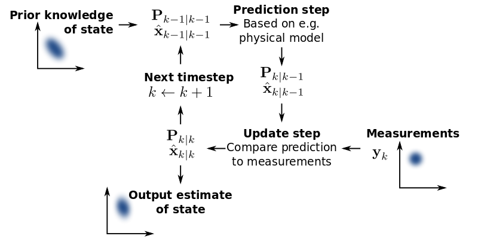

# Multi-Target Tracking Unscented Kalman Filter

Authored by [Yoonyoung Cho](jchocholate@gmail.com), 03/16/2018

## Summary of Objectives

[The IARC Mission 7](http://www.aerialroboticscompetition.org/mission7/) is characterized by a relatively general, yet still complex environment, in which many robots interact in a semi-stochastic manner.

That is, with some prior information on the general behavior, the system is nonetheless non-deterministic and the interaction of the robots would change in each iteration.
This is a unique opportunity to exploit *model-based* predictive strategies, while also accounting for the inherent randomness of the system.

In essence, we are trying to figure out the position of the roombas at any given moment, in order to faciliate the decision-making processes; in a sense, we are using a filter to preserve a sense of [object permanence](https://en.wikipedia.org/wiki/Object_permanence) for the drone; based on previous observations, and a farily well-characterized model of the system, we are trying to estimate the current status of the mission, and develop strategies accordingly.

As part of the perceptions development, I've been working on a multi-target tracking UKF with motion models in order to tackle this very issue;
while the pipeline is still under development, it has seen some positive progress that I would like to share.

## Brief Kalman Filter Overview

A Kalman Filter provides estimates through continuous iterations of predictions and updates, where the error residuals are reflected in how the estimated states and their uncertainties (represented as covariances) are modified. In the following diagram ([image source](https://en.wikipedia.org/wiki/File:Basic_concept_of_Kalman_filtering.svg)), we can see the basics of how a kalman filter works.

In our system, we have the *estimated* positions of the roombas, as well as *observations*; in typical applications, the incentive of applying a Kalman Filter are as follows, where the ones that apply to us have been checked:

- [x] To refine the observations, which are prone to noise;
- [x] To provide predictions, based on pervious known states;
- [x] To deduce additional information, such as velocity and orientation, based on observations without full-state information.
- [ ] To utilize multiple information sources and fuse them to obtain the best estimates (sensor fusion).

This is also true for our model; in order to develop an effective strategy for redirecting the roombas, it is critical to have a fairly accurate world-coordinate positions of the roombas, as well as their orientation, and how they will change over time. Note that there is no need for sensor fusion, given that we only have one realistic source of the roombas' location, which is the downward-facing camera. So far so good!

### Dealing with a Complex System

While that sounds great in *principle*, a shortcoming for a traditional kalman filter is that it is only really effective for *linear* system. In order to mitigate this issue, alternative forms of the kalman filter have been developed, such as the Extended Kalman Filter(EKF) which linearizes a nonlinear system through the jacobians. This is often a close-enough approximation of the system, where the *slope* of the system transition is evaluated at every point to yield a first-order estimate of the predicted behavior.

In our development, we have been using an Unscented Kalman Filter(UKF), as it had the most flexibility in terms of producing the estimates, and it could deal with nonlinearities in a very elegant manner ([image source](https://figshare.com/articles/_schematic_representation_of_the_unscented_transform_/662231)).

In a brief description, a UKF employs an [Unscented Transform](https://en.wikipedia.org/wiki/Unscented_transform) in order to achieve an approximation of the best estimate of how a certain probabilistic distribution will evolve, by sampling sigma points based on the prior values.

## Target Associations

A unique problem that arises when there are multiple, visually indistinguishable targets on the ground is figuring out the associations between the internal models (estimates) and the observations. We take a probabilistic approach, in which we look at the list of estimates and observations, and match them each based on the likelihood that the observation was drawn from the multivariate gaussian distribution of the each estimate. When an observation doesn't match with any of existing estimates, we add them to the list; otherwise, the best-matching estimate is updated with the observation if the matching probability is sufficiently high.

### Multivariate Matching

In order to obtain target assocations, we employ multivariate matching based on the covariances of the estimates and the observations; because the distribution is multivariate, simply multiplying each of the distributions by the gaussian yields incorrect results; in order to accurately determine the likelihood that the observation belongs to the target, we employ the cumulative distribution function (CDF) of a multivariate gaussian distribution, as implemented in `scipy.stats.mvn`.

Above, we see the resulting scores corresponding to each deviation from (0,0,0). Whereas we could use simple metrics such as the euler distance of the observation from the mean, it is critical to also take orientation into account, and to consider the uncertainties of the estimates in the matching procedure, which is why we chose to take on the additional complexity.

### Hungarian Algorithm

A known solution that solves the assignment problem is the [hungarian algorithm](https://en.wikipedia.org/wiki/Hungarian_algorithm) where we use `scipy.optimize.linear_sum_assignment` for the actual implementation. We simply define the matching cost as 1-p, which is fairly common in the conversion between probability and matching cost.

## Motion Model

In addition to the observations, we also assign motion models for predictive simulations; the type information for each of the roombas are available from the visual detections node, which can be used in conjunction with the observations to provide a good estimate for how the roombas will behave. In particular, it is critical to determine the transition schedules of the roombas -- whether or not they run a continuous loop around the origin, or undergo noise and reversals at given periods. For un-observable roombas, the positions are estimated through an applied model of the anticipated movement since the first transition; otherwise, the observations take priority, since it inherently makes the least assumptions about the respective motions.

## Implementation

For faster testing, we implemented the filter and a fully working simulation *without* ROS binding; this way, we could quickly test the filter with any code written in python, without necessarily having to involve messaging across different nodes. For ROS integration, we simply provided a single interface that converts between incoming/outgoing ROS messages and the filter manager itself.

Below, we see a quick visualization of the filter in action:

and inside a fully simulated environment in Gazebo: ([video link](https://www.youtube.com/watch?v=WNuSyY4nzlk))

