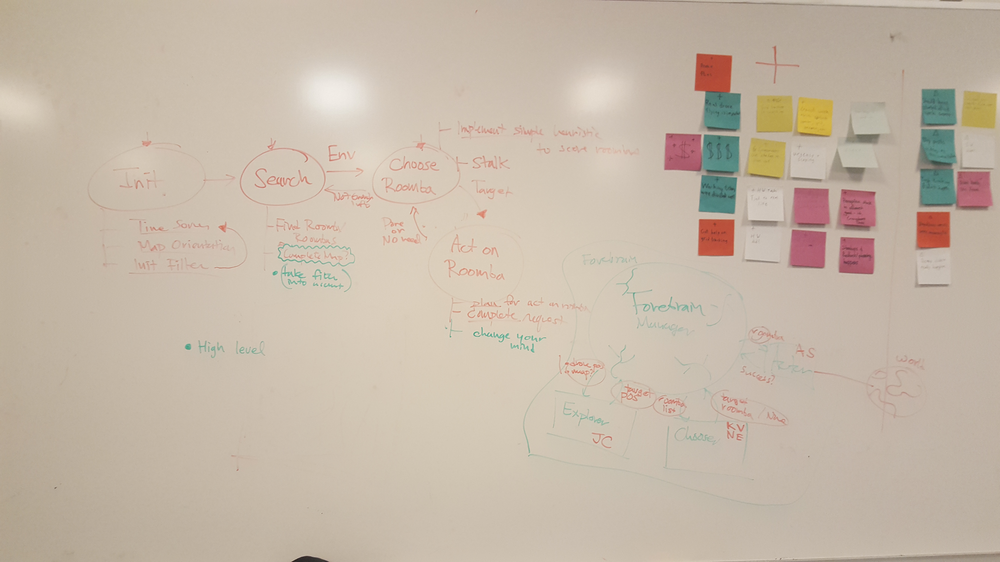

# IARC Prediction and Strategy Development

---

Current Development Architecture:



## Exploration

To test exploration with 2D Simulation:

```bash
roscore
roslaunch iarc_sim_2d basic.launch
roslaunch iarc_main backbone.launch
rostopic pub /arbiter/activate_behavior std_msgs/String "data: 'forebrain'" 
rosrun iarc_strategy explorer.py 
rosrun iarc_forebrain forebrain.py
```
